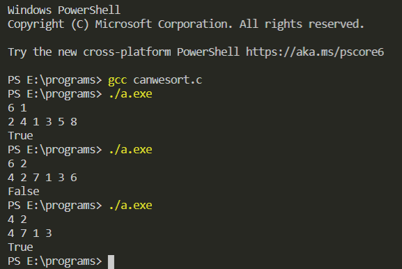

### Description

Given an array A with n integers return True if it is possible to sort the array in increasing order by swapping the i-th element A[i] with the (i+k)-th element A[i+k] else return False. You may perform the operation any number of times.

## Input Format

```
n k
A1 A2 A3 ......An

```

# Example Output

```
input :
6 1
2 4 1 3 5 8
output:
True

input:
6 2
4 2 7 1 3 6
output:
False

input:
4 2
4 7 1 3
output:
True

```

[If you want to know how the code is implemented, CLICK HERE!!!!!](./canwesort.c)

Contributed by [Isha Verma](https://www.github.com/Isha2208)

### Output after execution of the code


