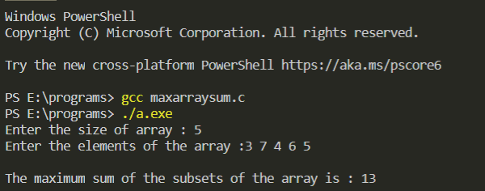

# Description

Given an array of integers, find the subset of non adjacent elements with the maximum sum. Calculate the sum of that subset. For example, for the set [-2, 1, 3, 4, 5], our maximum subset sum is 8 for the subset {3, 5}.

# Example

## Input Format

```
The first line contains an integer, n.
The second line contains n space separated integers arr[i].
```

## Output Format

Return the maximum sum descrbed in the statement.

### Example Output

```
Input :
Enter the size of array : 5
Enter the elements of the array :3 7 4 6 5
Output:
The maximum sum of the subsets of the array is : 13
```

[If you want to know how the code is implemented, CLICK HERE!!!!!](./maxarraysum.c)

Contributed by [Isha Verma](https://www.github.com/Isha2208)

### Output after execution of the code


