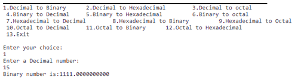
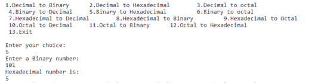
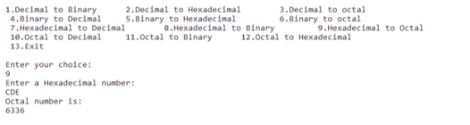
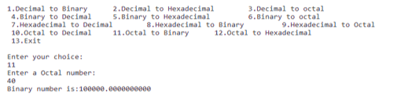

# Number System Conversion

### Features- 
A menu-driven code to convert a given number from one base system to another
Menu:
1. Decimal to Binary
2. Decimal to Hexadecimal
3. Decimal to Octal
4. Binary to Decimal
5. Binary to Hexadecimal
6. Binary to Octal
7. Hexadecimal to Decimal
8. Hexadecimal to Binary
9. Hexadecimal to Octal
10. Octal to Decimal
11. Octal to Binary
12. Octal to Hexadecimal
13. Exit

### To run- 
javac Convert.java
java Convert

### Screenshots-
1. Convert Decimal to Binary

  
2. Convert Binary to Hexadecimal 

3. Convert Hexadecimal to Octal

4. Convert Octal to Binary

## Contributor
[Pallavi Vaswani](https://github.com/pallavivaswani)
