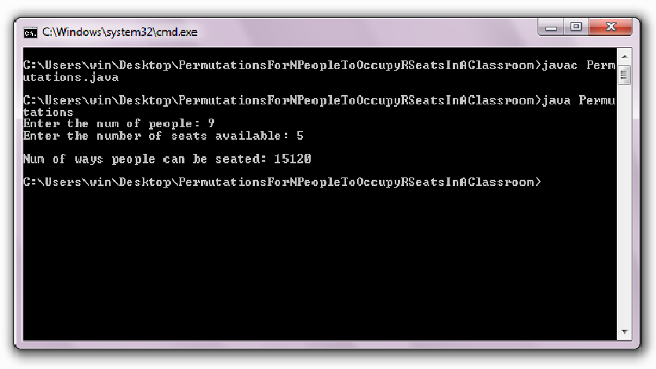

## Description
Write a code to find all the possible permutations in which N people can occupy R number of seats in a classroom
N students are looking to find R seats in a classroom. Some of the seats are already occupied and only a few can be accommodated in the classroom. The available seats are assumed as R and N number of people are looking to accommodate within the room.

# Input Format
```
  Enter the num of people: 9
  Enter the number of seats available: 5
```

# Example Output
```
Num of ways people can be seated: 15120

```

[Click here to see the implementation!](./Permutations.java)

Contributed by [Raj Sanghavi](https://www.github.com/raj2729)

## Output after execution of the code

