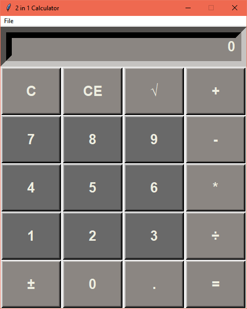
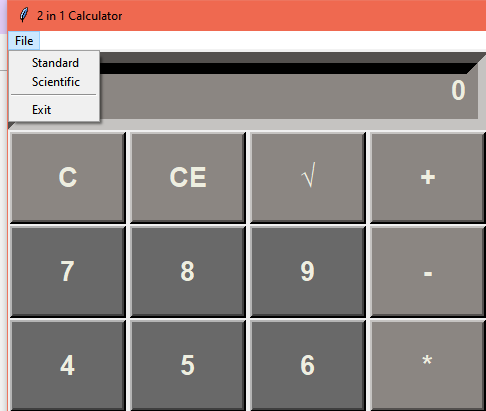
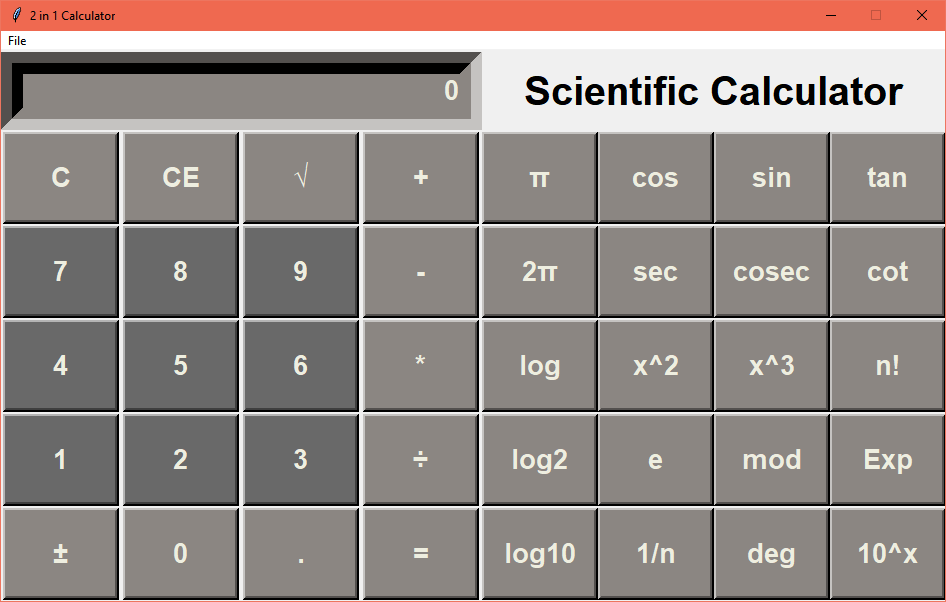

# 2 in 1 Calculator

### Features- 
This Application opens to a Simple Calculator with basic operations of add, subtract, multiply, divide.
The menu bar contains a button named 'File' which gives the option to switch to Scientific Mode.
The Scientific Calculator provides additional operations like sin, cos, tan, square, cube, factorial, log, inverse and a few more..

### Dependencies-
Python v3
 and Tkinter

### To run - 
python calculator.py

### Screenshots-
1. Simple Calculator

  
2. Switch from simple to scientific

3. Scientific Calculator

## Contributor
[Pallavi Vaswani](https://github.com/pallavivaswani)
