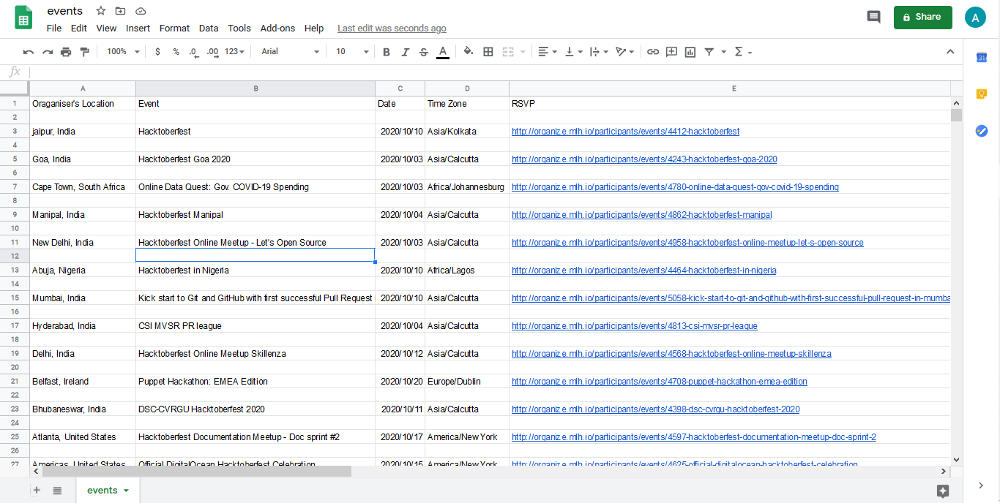

## *Author Name*
[Anshul Pandey](https://github.com/Anshul275)

### Description -
This script scrapes all the events from the Hacktoberfest events website and stores them in a csv file.

### Pre-Requisites
To install all the dependencies - pip install -r requirements.txt

### Working
To run the file - python events_scrapper.py

## Screenshots -
### Generated CSV File
