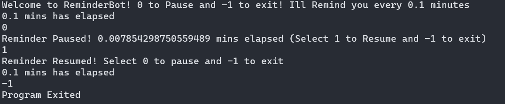

# Reminder Bot

Welcome to Reminder Bot. A simple multi threaded python application to remind you to walk every 20 minutes.

## Features
* Specific Audio reminders when running on terminal
* A centralized settings control file
* Customize duration of reminder
* Add your own personalized reminder statements with the create_audio.py

## Controls
* 1 - Resume
* 0 - Pause
* -1 - Exit

## Instructions
* Before running the program, run the below instruction.
    * pip install requirements.txt
* To run the main program, run the below instruction.
    * python reminder.py
* To add your own personalized text to speech statement, make the change in config.json as shown below,
    
        {   
        "time": 20, # Customize time in Minutes

        "text": "Hey Get up Arun." # Insert text in this statement
        
        }
    
    and run the below command.
    * python create_audio.py

# Sceenshot

# Creator
Code written by [Kiran MHM](https://github.com/GoluffyxD)
