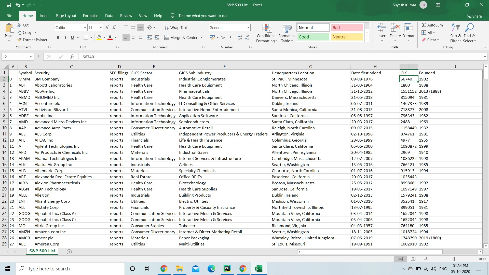

# S&P 500 Companies Scraper
Author : [skr-suyash](https://github.com/Skr-suyash)

A Web Scrape built using **Python** for scraping the details of S&P 500 Companies from Wikipedia.

# Installation
Install all the requirements

```pip install requirements.txt```

Run the main script

```python main.py```

# Output Demo

