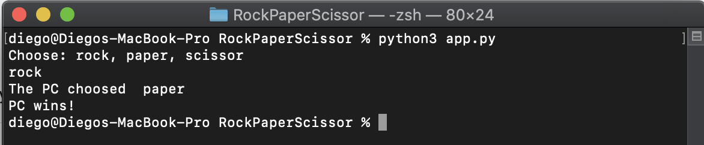

# Rock, paper, scissor

Just a simple rock, paper, scissor game written in python.

## Prerequisites

You just need to have python3 installed.

### Mac

The easiest way to get python in your mac is using [brew](https://brew.sh/index_es). If you have not installed brew on your computer run:
```bash
    /bin/bash -c "$(curl -fsSL https://raw.githubusercontent.com/Homebrew/install/master/install.sh)"
```

To install python 3 run 

```bash
    brew install python
```

### GNU/Linux

I will only show you how to install python on the distros I use.

#### Debian-based

```bash
    sudo apt install python3
```

#### Arch-based

```bash
    sudo pacman -S python
```

### Windows

Get the lattest release [here](https://www.python.org/downloads/windows/).

## Run

Open a term on this route and run:

```bash
    python3 app.py
```

In some distros the package python stands for python 3 and in other it stands for python 2 so take care with that.



## What is the logic behind

To determine the winner of the game each player's response is represented with an int. That int is its position on the list.

The list is sorted in such a way that each member defeats the previous one.

The script determines that it is a tie if the ints are equal and, if the difference between them is one, it determines that the greater wins.

Finally, we have to determine who wins between the limits of the list, or in another way, when the difference between the ints is two. In this case the minor wins (stone defeats scissors).

This could be implemented using a [circular buffer](https://en.wikipedia.org/wiki/Circular_buffer) but I thought that it was not worth it in this case.

## About the author

If you want to know about me you can get a lot of info on [my github](https://github.com/seniorglez).

