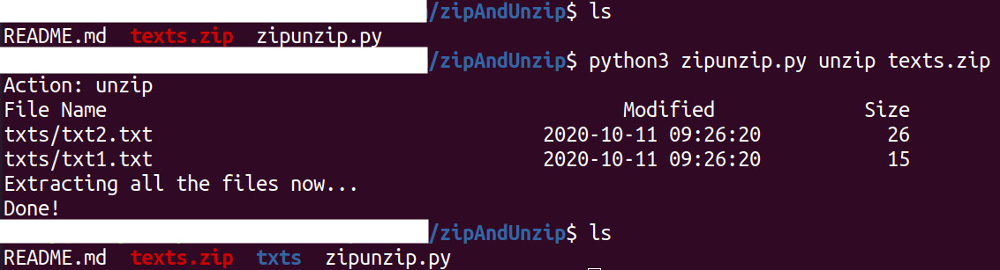
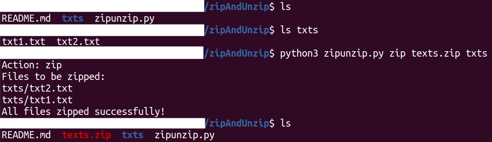

# Zip and Unzip 🤐

The file `zipunzip.py` contains code for zipping a folder or unzipping a `.zip` file. 

**NOTE: The following `zip` and `unzip` commands work only for `.zip` files.** 

## Unzipping a `.zip` file:

To unzip a `.zip` file, run:
```
python3 zipunzip.py unzip [filename].zip
```
For example:
```
python3 zipunzip.py unzip test.zip
```
This will unzip the file `test.zip` into the current directory. 

## Zipping a folder or multiple folders:

To zip multiple folders, run:
```
python3 zipunzip.py zip [filename].zip [folders to be zipped]
```
For example:
```
python3 zipunzip.py zip test1.zip folder1 folder2
```
This will create a zipped file `test1.zip` in the current directory, with contents of the folders `folder1` and `folder2`.

**NOTE: You can only zip folders, not files.**

## Screenshots:

- Unzipping: 

 <kbd></kbd>

- Zipping: 

 <kbd></kbd>

---

Contributed with :heart: by [Shrey Tripathi](https://github.com/shrey27tri01).


