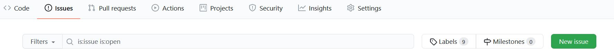
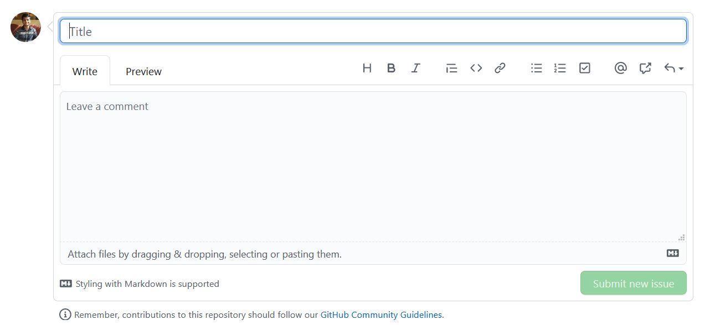
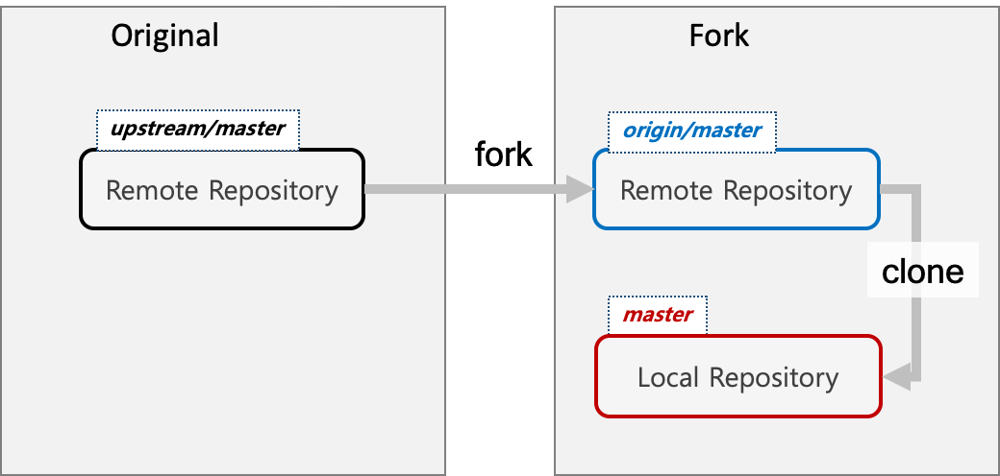
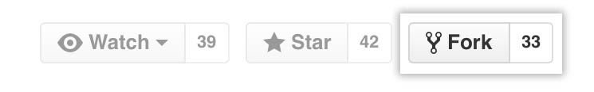
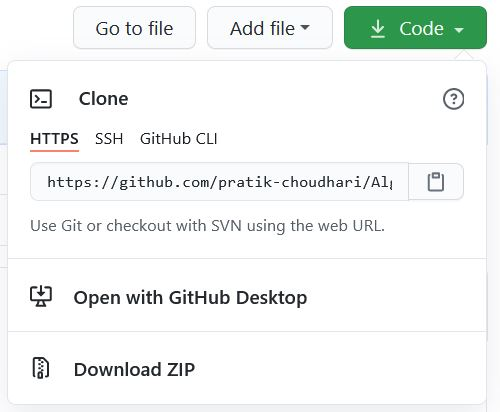
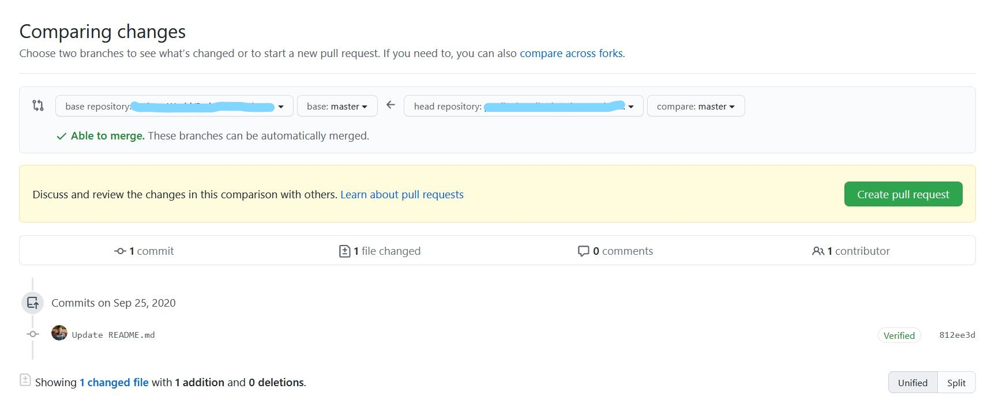
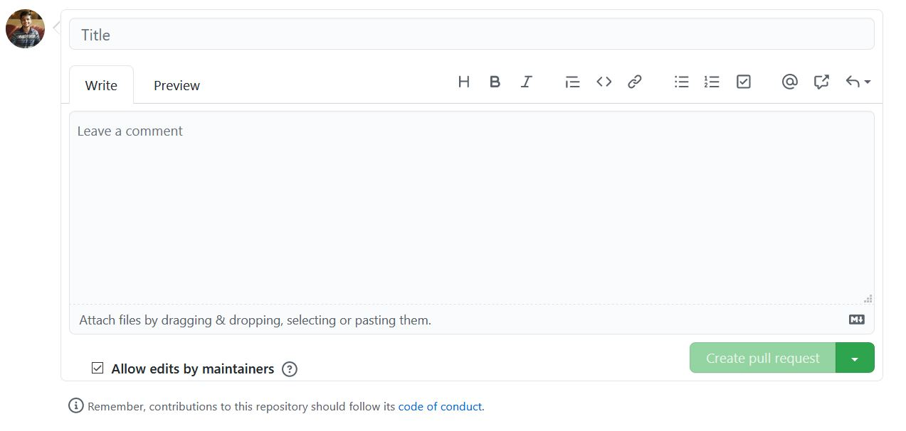

# AlgoCode ✨
[](https://forthebadge.com)
[](https://forthebadge.com)
[](https://forthebadge.com)
[](https://forthebadge.com)


Hey there!👋 

## What can you do here?🧐
* You can solve questions put up by contributors (tag moderators in comment to assign an issue to you and mention the language you will be using).
* You can put up a problem yourself.
* You can even contribute a project made by you!

## New to github? No problem :)🆕
* Git and github crash course by TraversyMedia: [Youtube](https://www.youtube.com/watch?v=SWYqp7iY_Tc)
* Git and github for beginners by FreeCodeCamp: [Youtube](https://www.youtube.com/watch?v=RGOj5yH7evk)
* Git and github articles on atlassian.com: [Website](https://www.atlassian.com/git/tutorials)

## Steps to put up an issue:📑

First let's see when should you create an issue?
* If you want to contribute a question or project.
* If you have a better solution to an existing solved issue.

### To create an issue:

Click on the [Issue button](https://github.com/pratik-choudhari/AlgoCode/issues) at top of the page:<br>


Click new issue and fill up the details!<br>


__Note: Issues must clearly mention what they are addressing, if a problem is being put up then explain it using an example.__

## Get contributing🤩

__Note: One must read [CODE_OF_CONDUCT](https://github.com/pratik-choudhari/AlgoCode/blob/master/CODE_OF_CONDUCT.md) before starting work on any issue__

First things first, In order to contribute you have to create a Pull Request from your forked repo which is a remote clone of this upstream repository.<br>
</img>

1. Click this button at the top of screen to fork this repo, don't forget to star the repository!:<br>
    

2. Now head over to the forked repository and copy the clone HTTPS URL:<br>
    


3. Next up clone the forked repo on to the local machine using:<br>

    ``git clone <copied-fork-link>``
    
4. It is critical to keep your [forked repository in sync the upstream](https://www.freecodecamp.org/news/how-to-sync-your-fork-with-the-original-git-repository/) repository so merge conflicts can be avoided:
    ```
    git remote add upstream https://github.com/pratik-choudhari/AlgoCode.git
    git fetch upstream
    git pull upstream master
    git push
    ```
5. Create a seperate branch to work on:<br>

    The branch name must be selected according to the issue<br>

    ``git checkout -b <branch-name>``

6. Contributors must follow the directory structure guidelines:
    * All files must be kept in a directory.
    * Directory name must resemble the issue assigned.
    * Based on the language used, create a directory inside the language directory.
    * Example: If I am writing in `Python` I will create a directory inside `Python` directory.
    * In case a project is being contributed make sure to add the files inside a directory(name according to project) which in turn must be placed inside the `Projects` directory.
    * Changes done by you will not affect existing structure of the project.
    * Add a README.md with your name and link to github profile using \[your-name](link-to-profile)

7. After the contribution work is ready go ahead and add it to staging area:<br>

    ``git add -A``

8. Now it is time to commit your changes and sync these changes to forked repo:<br>

    ``git commit -m <your_message>``

    ``git push origin <branch-name>`` 


9. Issue a [pull request](https://www.freecodecamp.org/news/how-to-make-your-first-pull-request-on-github/) from forked repo to this repo:<br>
    * Head over to `Pull Request` tab in the forked repo and click on `New Pull Request`
        
    * Verify base and head repository name and branch names.
        
    * Fill in the title and provide a concise description.
        
    
10. Wait for respose on the PR. Congratulations you just contributed to open source!

11. Get your name in CONTRIBUTORS.md!

## Code of conduct 👨‍💻
[CODE_OF_CONDUCT.md](https://github.com/pratik-choudhari/AlgoCode/blob/master/CODE_OF_CONDUCT.md)

## Our contrubitors(updated daily) ❤
[CONTRIBUTORS.md](https://github.com/pratik-choudhari/AlgoCode/blob/master/CONTRIBUTORS.md)

## Labels 🏷

__Issues labelled with language name e.g Python, mean that the particular issue has been assigned for language in the label__

__Note that a problem can be solved in above mentioned languages unless any language is explicitly mentioned__

## About me 

<table>
    <tr>
        <td>
            <a href="https://github.com/pratik-choudhari/"></a>
        </td>
        <td>
            Hi! I am Pratik Choudhari an undergrad student. Recently I have discovered my liking for open source since then I have been working diligently towards it and here I am with this repository😄.
        </td>
    </tr>
</table>

Got something interesting to talk about? Let's connect

<a href="https://www.linkedin.com/in/pratik-choudhari/"></a>
<a href="https://github.com/pratik-choudhari/"></a>
